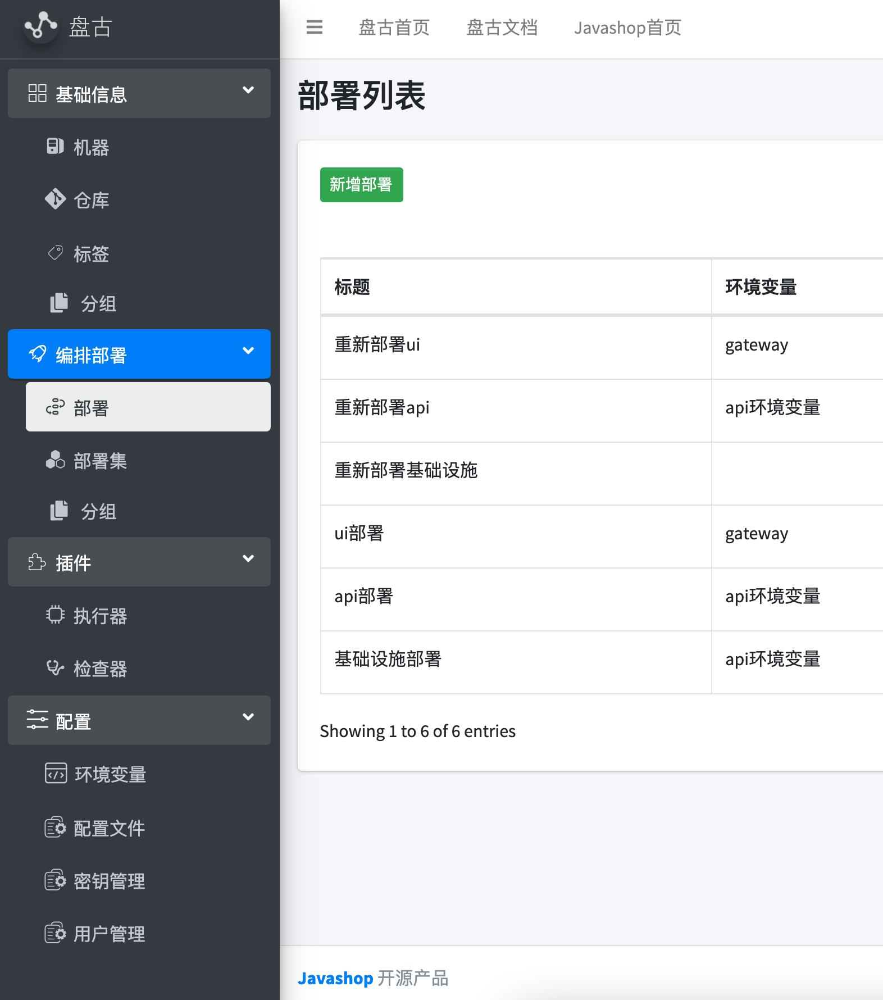
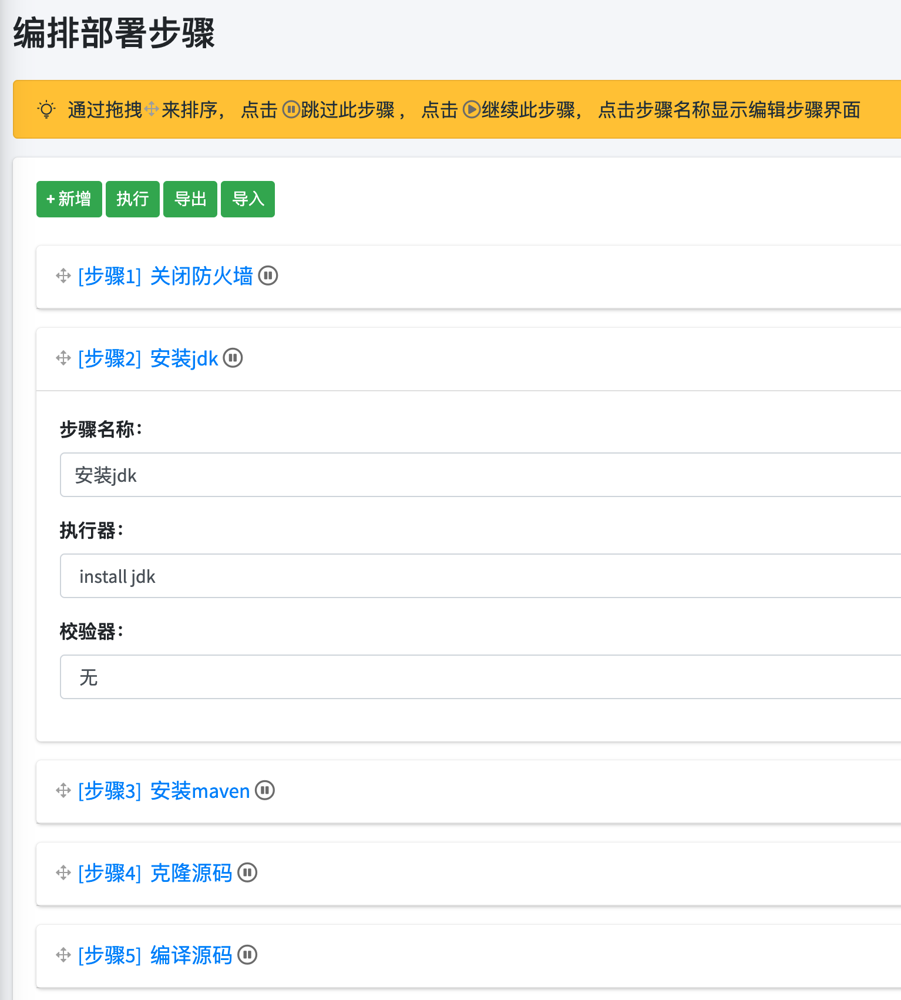

# 盘古可持续集成工具

[盘古](https://pangu.javamall.com.cn/)是[javashop团队](http://www.javamall.com.cn/)内部总结多年的部署经验推出的一款开源的devops工具， 致力于在提供简单、使用、高效的可持续集成服务。在目前流行的devops工具 中缺少对机器、仓库、步骤、环境变量的明确定义、操作，盘古提供了上述的资 源的管理，并提供了导出导入功能，极大方便了部署过程。

## 官网&文档

[盘古官网](https://pangu.javamall.com.cn)

[盘古文档](https://pangu.javamall.com.cn/docs/#/)

## 特色功能

#### 简易安装

基于Java+h2，一个jar包即可运行
#### 机器管理
提供机器管理、标签设置，按机器按标签，批量部署
#### 仓库管理
提供仓库管理、方便部署编排
#### 环境变量、配置文件支持
统一定义如mysql密码、spring boot配置文件等
#### 项目管理
按项目汇总配置文件、环境变量，简化编排过程
#### 插件
插件式扩展， 提供无限可能

