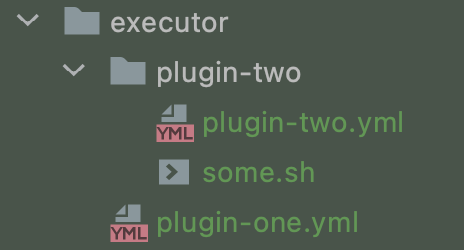

# 插件开发

插件包括一下几种：

| 插件类型 | kind标识 | 说明                       |
| -------- | -------- | -------------------------- |
| 执行器   | executor | 在部署时被执行             |
| 检查器   | checker  | 完成某个步骤时，对结果检测 |

## 插件示例

盘古的插件是用yml格式定义的：

~~~yaml
#插件版本
version: 1.0

metadata:
  #类型，必须
  #可选值：
  #1.executor:执行器
  #2.checker:检查器
  #3.deployment:部署

  kind: executor

  #定义插件名称,必须
  name: "git clone"

  #定义id，必须，不能有空格
  id: git_clone

  #定义插件描述，可以为空
  desc: git clone 插件

  #定义作者名字，必须
  author: javashop

  #定义作者的链接，可以为空
  author_url: "https://www.javamall.com.cn"

#定义要传输到服务器中的文件
#source是本地文件路径，以classpath为根目录的相对路径
#target是远程目标路径，可以使用${worksapce}变量
copy:
  - source: executor/git_clone/git_clone.sh
    target: ${workspace}/git_clone.sh

#定义要执行的命令
command:
  #定义命令的类型，目前支持ssh 命令，必须
  type : ssh
  exec :
   - "sh  ${workspace}/git_clone.sh"

#插件的配置项，可以是多个配置项，可以为空
#每个配置项，会在配置界面展示
#客户输入的值在解析命令的时候会通过$ {变量名}解析出来
#type支持：
#1、input :单行文本
#2、textarea:多行文本
config :
  item:
    title: 源码目标路径
    name: dir
    type: input
    htmlcss: "width:100px"

~~~

# 插件的存放

插件可以存放在两个位置：

1、源码的resources目录

2、打包后的jar同级plugins目录

## 子目录

| 目录     | 说明              |
| -------- | ----------------- |
| executor | 存放执行器yml文件 |
| checker  | 存放检查器yml文件 |

插件可以是单独直接在相应的文件夹中，也可以自己独立一个文件夹存放，比如：

如上图所示，"plugin-one"直接存放在executor目录中，"plugin-two"单独在一个文件夹中，一般地是这个插件还存在除了yml文件以外的文件所以单独存在一个文件夹比较方便。

# 插件的书写与测试

首先您需要熟悉git fork，可以参考下面的文档：

https://gitee.com/help/articles/4128#article-header0

## 第一步：Fork盘古插件仓库

请fork下面的仓库：

https://gitee.com/javashop/pangu-plugin

## 第二步：建立插件文件

在您fork的仓库中：

在resources目录中建立你的插件文件，如：/resources/executor/test.yml

## 编写插件

根据需求按规则编写yml文件，您可以参考这个[示例插件](https://gitee.com/javashop/pangu-plugin/blob/master/example.yml)

## 第三步：测试插件

使用如下代码测试插件:

~~~java
@RunWith(SpringRunner.class)
@SpringBootTest()
@ComponentScan("com.enation.pangu")
public class PluginTest {

    /**
     * 插件业务类
     */
    @Autowired
    ExecutorManager executorManager;

    /**
     * ssh客户端
     */
    SshClient sshClient;

    /**
     * 环境变量
     */
    Map env = new HashMap();

    //环境变量
    String workspace = "/opt/workspace/";

    /**
     * 测试前构建ssh client及 workspace
     * @throws IOException
     */
    @Before
    public  void init() throws IOException {
        env.put("workspace",workspace);

        //在这里定义测试机的信息
        sshClient = SshClientFactory.createSsh("root", "123456", "192.168.2.55", 22);

        //先创建workspace
        sshClient.exec("mkdir -p "+ workspace,text->{
            out.println(text);
        });

    }

    /**
     * 测试结束后断开ssh连接
     * @throws IOException
     */
    @After
    public void clean() throws IOException {
        sshClient.disconnect();
    }

    /**
     * 执行器测试
     * @throws ScriptException
     */
    @Test
    public void gitClone() throws IOException {
        //环境变量

        env.put("username", "2323");
        env.put("password", "2323");
        env.put("git_url", "https://gitee.com/javashop/pangu.git");
        //执行插件，第一个参数时插件id，第二个参数是插件类型，第三个参数是环境变量，第四个参数是ssh客户端
        boolean result = executorManager.runExecutor("git_clone",PluginType.executor, env, sshClient);
        out.println(result);
    }

    /**
     * 检查器测试
     * @throws IOException
     */
    @Test
    public void checkerTest() throws IOException {
        //执行插件，第一个参数时插件id，第二个参数是插件类型，第三个参数是环境变量，第四个参数是ssh客户端      
        boolean result = executorManager.runExecutor("install_one", PluginType.checker, env, sshClient);
        out.println(result);
    }
}
~~~

> 注意：开发好的插件，需要在插件页面点击同步才会出现在相应的列表中

# 贡献你的插件

欢迎您将插件贡献给盘古，共享方式为需要您从自己的fork的仓库建立一个PR到如下仓库

https://gitee.com/javashop/pangu-plugin

操作方式参考如下文档：

https://gitee.com/help/articles/4128#article-header0

创建pull request时需要您备注好插件的作用以及您的联系方式，或扫描计入盘古微信交流群，发送一个消息给我们，以便我们及时审核您的PR，如果我们审核通过后，就可以被其他人安装使用啦。

> 请先扫码并关注公共账号，可以自动加入盘古交流群：

